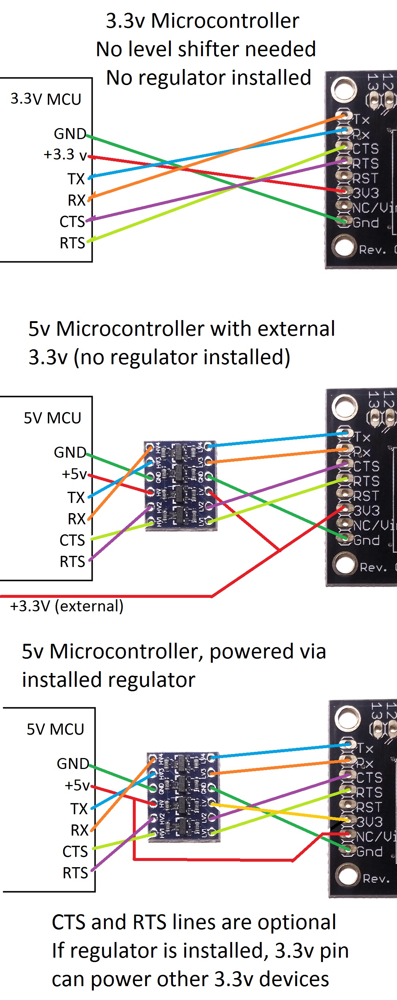

# ttn-soundlevel

A project started at [MakeZurich](http://makezurich.ch), sends average sound level to a device on [The Things Network](https://www.thethingsnetwork.org).

Uses an RN2483 LoRaWAN board with an Arduino Pro Mini.

Now updated for V3, here are some helpful links to get started:

- [Wiring the node](https://www.tindie.com/products/DrAzzy/rn2483-breakout-bare-board/)
- [Connecting the node](https://www.thethingsnetwork.org/labs/story/ttn-node-with-esp8266-and-rn2483#!)
- [TTN Node Arduino + RN2483](https://www.thethingsnetwork.org/forum/t/how-to-build-your-first-ttn-node-arduino-rn2483/1574)
- [Coding the radio](https://www.espruino.com/RN2483)
- [Examples from the library](https://github.com/jpmeijers/RN2483-Arduino-Library/blob/master/examples/ESP8266-RN2483-basic/ESP8266-RN2483-basic.ino)
- [Registering your app in TTN console](https://www.thethingsindustries.com/docs/devices/the-things-uno/#writing-your-first-sketch-to-get-the-deveui-and-appeui)